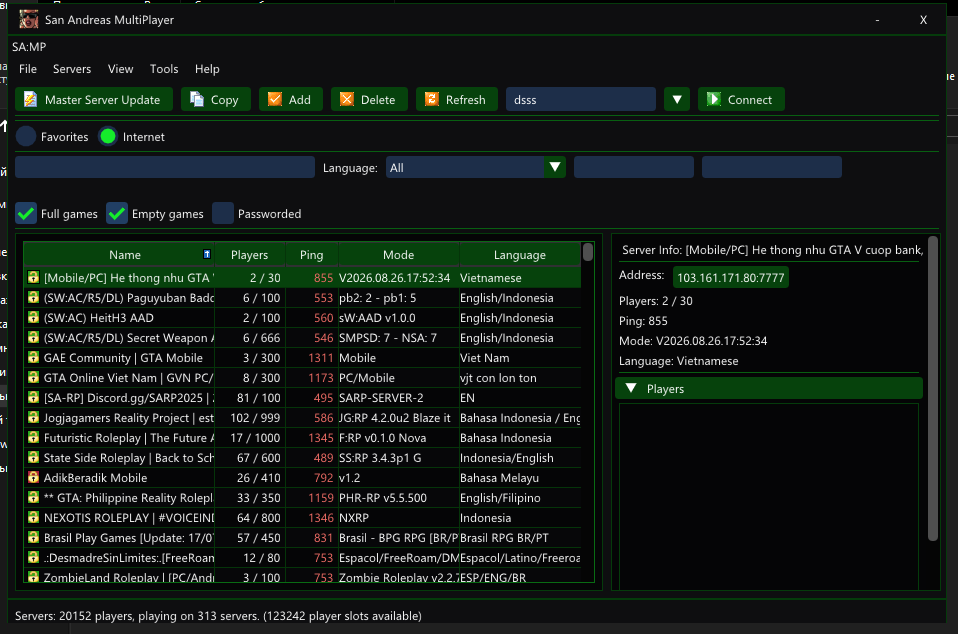
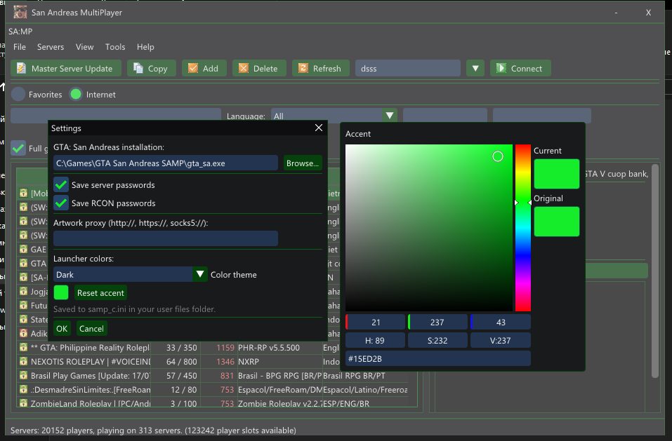

# SA:MP Лаунчер

Современный, написанный «с чистого листа» **C++ / Win32 / Dear ImGui**
лаунчер для **San Andreas Multiplayer 0.3.7 / 0.3.DL**.

Полностью переписан без VCL / RAD Studio. Собирается с помощью
**MinGW-w64** и **CMake** (Ninja). Рисует собственный интерфейс на Dear ImGui
(бэкенд D3D11).

> Это проект сообщества — переделанный классический лаунчер SA:MP. Он **не**
> связан с Rockstar Games, Take-Two Interactive или командой SA:MP.
> Перед использованием прочитайте `DISCLAIMER.md` и `LICENSE.txt`.

---

## Возможности

- Полноценный серверный браузер (список мастер-сервера, избранное, hosted)
  на Dear ImGui — без VCL и элементов ОС
- Асинхронные, многопоточные запросы к серверам (пинг, инфо, игроки, правила)
- Настраиваемый поиск и фильтры: имя / IP / режим / карта / **язык
  (выпадающий комбобокс с живым поиском, ~100 языков и региональных
  вариантов)**
- Переключатели «показать/скрыть»: полные серверы, пустые, с паролем
- Контекстное меню по правой кнопке мыши: Connect, Server Properties,
  Copy Server Info, Refresh Server
- Диалог свойств сервера с кнопкой Connect
- Список избранного (сохранение / загрузка), импорт и экспорт
- Поддержка RCON-консоли
- Настройки темы и акцентного цвета, сохраняются в `samp_c.ini`
- История ников (сохраняется в `nickhistory.xml`)
- Полная поддержка High DPI, фиксированный размер окна
  (без изменения размера / полноэкранного режима)
- Иконка SAMP в заголовке окна и на панели задач
- Статическая (без runtime DLL) или динамическая сборка MinGW

---

## Требования для запуска

- Microsoft Windows (7 SP1 / 8 / 8.1 / 10 / 11), рекомендуется 64-битная
- **Легальная копия Grand Theft Auto: San Andreas (2004)** — обязательна,
  лаунчер **не** прилагает и не скачивает игру
- **Клиентские файлы SA:MP**, самое главное — **`samp.dll`**, в папке рядом
  с `gta_sa.exe`
  - Лаунчер **не** включает `samp.dll`.
  - Без `samp.dll` **невозможно зайти на сервер** — лаунчер показывает
    окно с ошибкой и прерывает запуск.
  - Скачивайте клиентские файлы SA:MP только из проверенных источников.

---

## Сборка (Windows)

### Инструменты

- **CMake** ≥ 3.16 (проверялось с CMake из комплекта MinGW-w64)
- **MinGW-w64** (GCC / G++) — проверялось с `C:\MinGW64\mingw64`
- **Ninja** (`ninja.exe` в `PATH`)

### Настройка (динамическая сборка)

```powershell
cmake -S . -B build -G Ninja `
  -DCMAKE_MAKE_PROGRAM="C:\Path\To\ninja.exe" `
  -DCMAKE_C_COMPILER="C:\MinGW64\mingw64\bin\gcc.exe" `
  -DCMAKE_CXX_COMPILER="C:\MinGW64\mingw64\bin\g++.exe" `
  -DCMAKE_BUILD_TYPE=Release
```

### Сборка

```powershell
cmake --build build --config Release
```

Результат: `build\samp.exe`

### Статическая сборка (без runtime DLL MinGW)

Добавьте `-DSAMP_STATIC=ON` при настройке:

```powershell
cmake -S . -B build -G Ninja `
  -DCMAKE_MAKE_PROGRAM="C:\Path\To\ninja.exe" `
  -DCMAKE_C_COMPILER="C:\MinGW64\mingw64\bin\gcc.exe" `
  -DCMAKE_CXX_COMPILER="C:\MinGW64\mingw64\bin\g++.exe" `
  -DCMAKE_BUILD_TYPE=Release `
  -DSAMP_STATIC=ON
cmake --build build --config Release
```

В статической сборке `samp.exe` линкует рантайм MinGW статически, поэтому
получается один самодостаточный `samp.exe` без зависимостей
`libstdc++-6.dll`, `libgcc_s_seh-1.dll` и `libwinpthread-1.dll`.

### Также в комплекте

Два удобных bat-скрипта, рассчитанных на типичное локальное расположение
инструментов:

- `dynamic_build.bat` — настройка + сборка в `build\`
- `static_build.bat` — настройка + сборка с `-DSAMP_STATIC=ON`

Оба пишут лог в `logs\`.

---

## Установка и запуск

1. Соберите `samp.exe` (см. выше) **или** скачайте готовую сборку.
2. Положите `samp.exe` в любое удобное место.
3. Убедитесь, что установлена ваша **лицензионная** копия GTA: San Andreas и
   что `samp.dll` (клиент SA:MP) лежит рядом с `gta_sa.exe`.
4. Запустите `samp.exe`, выберите сервер и нажмите **Connect**.

> При первом запуске рядом с лаунчером создаются `nickhistory.xml`
> и `samp_c.ini`.

---

## Скриншоты





---

## Структура репозитория

```text
launcher/          Исходники C++ (main.cpp, core.cpp/h, languages.h)
imgui/             Dear ImGui (MIT; imgui/LICENSE.txt)
resource/          Иконка, манифест, ресурс версии, PNG-иконки
screenshots/       Скриншоты интерфейса
CMakeLists.txt     Скрипт сборки CMake
dynamic_build.bat  Динамическая сборка в один клик (пути MinGW преднастроены)
static_build.bat   Статическая сборка в один клик
LICENSE.txt        GNU GPL v3 — полный текст
DISCLAIMER.md      Товарные знаки / права собственности / права третьих лиц
README_EN.md       Эта документация на английском языке
```

---

## Авторы и лицензии

- **Этот лаунчер** — написан с нуля на C++/Win32/Dear ImGui
  (без VCL). Лицензия **GPL-3.0**, см. `LICENSE.txt`.
- Концепции сборки и структура проекта основаны на открытом проекте
  [`1therealcloud/samp-launcher`](https://github.com/1therealcloud/samp-launcher)
  (GPL-3.0).
- **Dear ImGui** — Omar Cornut и участники, лицензия MIT
  (`imgui/LICENSE.txt`).
- **SA:MP** — мультиплеерный мод сообщества, не связан с издателями игры.
  См. `DISCLAIMER.md`.
- **Grand Theft Auto: San Andreas** (2004) — копирайт Rockstar North /
  Rockstar Games / Take-Two Interactive. Этот проект не одобрен и не
  спонсируется ими. См. `DISCLAIMER.md`.

---

## Отказ от ответственности (кратко)

Программа предоставляется «как есть», **без каких-либо гарантий**.
Вы используете её на свой риск. Она не связана с Rockstar Games,
Take-Two Interactive или командой SA:MP, не одобрена и не спонсируется ими.
Полные правовые уведомления — в `DISCLAIMER.md` и `LICENSE.txt`. English
version: `README_EN.md`.